Nom de l'auteur :  Thomas CISERANE
Date de réalisation : 09/02/2025

## 1. Premier container

### 1.1. Hello World

Pouvez-vous expliquer avec vos mots ce qui s'est passé suite à l'exécution de cette commande?

L'image "hello-world" n'était pas initialement installé alors Docker a installé  celle-ci automatiquement dans sa version la plus récente puis à créé un container avec cette image et l'a exécuté.


### 1.2.  Observer un container

Résultat obtenu après l'exécution de la commande "docker container ls -a" :

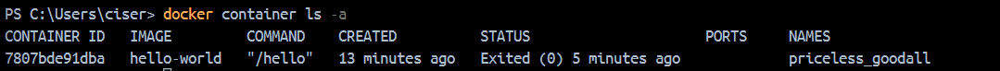

Retrouvez les informations suivantes sur le container lancé précédemment :

1. Quel est son identifiant ?

    Son ID est **7807bde91dba**d736e1b92888ec5562026425f99ace51feaa46fbf2dd7086b2de, soit **7807bde91dba** sur l'image.

2. Quel est son nom ?

    Son nom est priceless_goodall.

3. Quel est son état ?

    Son état est Exited car l'execution du container s'est terminée 5 minutes plus tard

4. Quel est le nom de son image?  Avez-vous vu au point 1.1. d''où cette image provenait?

    Le nom de son image est hello-world.

5. Quelle commande le container a-t-il exécuté?

    Il a exécuté la commande "/hello".

6. Si vous avez installer Docker Desktop, pouvez-vous retrouver ces mêmes informations dans l'interface graphique?

    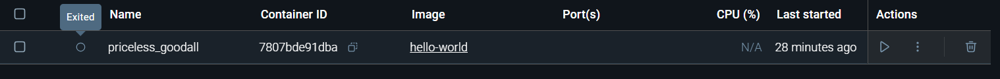

    Pour trouver la dernière information soit celle de la commande, il faut rentrer dans le container, aller dans l'option "Inspect" puis trouver la commande dans le JSON.

    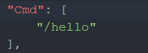

### 1.3. Les images

1. Quelles informations voyez-vous?  Quel est le lien avec ce que vous avez observé auparavant?

    On retrouve le nom de l'image, sa version, son ID, Date de création et sa taille.
    En dehors des attributs cités juste avant, en rentrant dans l'image, on retrouve les étapes de comment celle-ci a été contruite et exécutée (commande "/hello").

    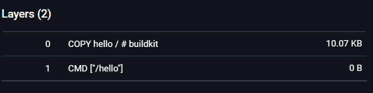

    Le lien pourrait être que le container a utilisé cette image lors de sa création pour exécuter la commande "/hello".

2. Comparez l'output de cette commande avec la vue correspondante de l'interface graphique.

    On retrouve les mêmes informations que ceux de l'interface graphique.

    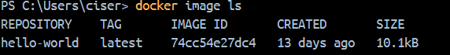
    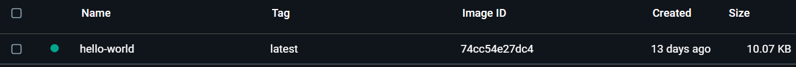

3. Essayez de trouver la commande qui vous permettra de supprimer cette image.  C'est une bonne idée de ne pas conserver les images non utilisées sur votre système de fichiers : même avec la mutualisation de couches, elles prennent de l'espace sur le disque!

    Pour supprimer une image on peut utiliser la commande "docker image rm -f" ou "docker rmi -f" avec "-f" pour forcer la suppression.

### 1.4. Les volumes

## 2. Utiliser un container

### 2.1. Interagir avec un container

1. A quoi servent les options ```i``` et ```t```dans la commande ci-dessus?

    Les options ```i``` et ```t``` servent respectivement à maintenir l'entrée standard (stdin) ouverte, permettant d'interagir avec le conteneur et permettant d'avoir les fonctionnalités d'un terminal toujours dans l'interaction, comme par exemple le mot de passe ne s'affiche pas quand on le rentre, sans l'option ```t```, il s'afficherait.

2. Chaque container Docker est destiné à exécuter une commande unique.  Quelle est-elle dans ce cas-ci?

    La commande est "/bin/bash".

3. Dans le container, quels sont les processus présents?  Et leurs PIDs?

    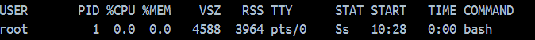

    Le processus est "bash" et son PID est 1

4. Avec quel utilisateur êtes-vous loggé?

    L'utilisateur est "root".

5. Votre container a-t'il accès à Internet?  Qui est son résolveur?

    Oui le conatiner a accès à internet :

    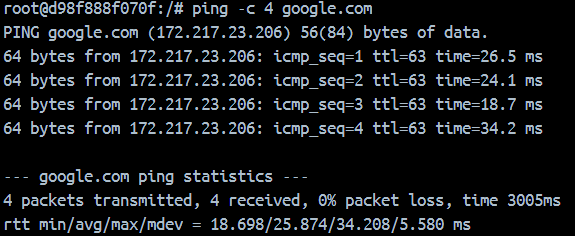

    Et son resolveur est: 192.168.65.7

    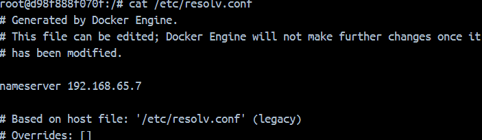

### 2.2. Inspecter un container

1. Chaque container dispose d'une interface réseau.  Quelle est l'adresse **IP** de l'interface de votre container?

    L'adresse IP est **172.17.0.2**.

    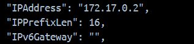

2. Votre container a-t'il des **ports** ouverts?  

    Non, aucun port n'est ouvert.

    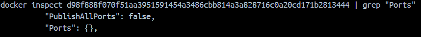

### 2.3. Faire tourner un service dans un container

- Qu'avez-vous observé au niveau des "ports" ?  Expliquez et illustrez votre réponse avec des screenshots.

    Ici on voit que nginx tourne sur le port 80 utilisant le protocole TCP mais pas encore accessible en dehors de la machine.

    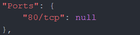

    Après avoir exécuté la commande suivante: ```docker run -p80:80 --name=mon-serveur-web2b nginx```  et lancé le container, on voit qu'il est accessible en dehors de la machine car on préciser le port de la machine sur lequel il est lancé.

    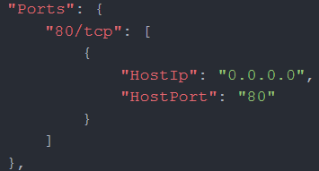

## 3. Construire des images

### 3.1. Figer un container

Après avoir utilisé les commandes:

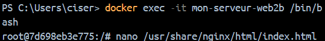

<br>

Après la modification de l'index.html:

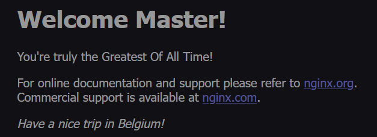

<br>

Sauvegarde de l'image modifiée à l'aide de la commande: ```docker container commit mon-serveur-web2b myweb```

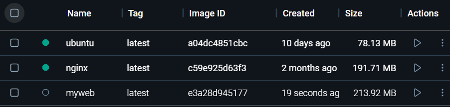

### 3.2. Créer une image sur base d'un Dockerfile

Après la création du Dockerfile et du fichier index.html, j'ai créé l'image suivante:

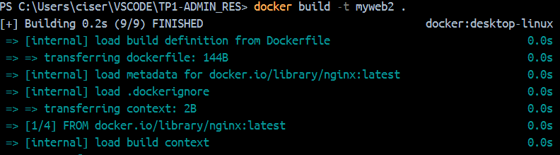
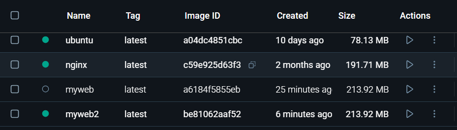

Puis pour un test j'ai crréé un container sur base de cette image avec la commande suivante: ```docker run --name=web -p80:80 myweb2```

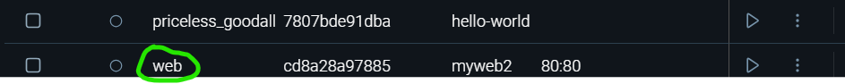

Puis j'ai lancé le container et j'ai observé qu'il est accessible en dehors de la machine.

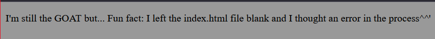

## Exercices récapitulatifs

Documentez ici la réalisation des exercices, via des explications et des snapshots.

### 4.1. Démarrer un serveur Web Apache

Pour l'image Apache, j'ai choisi "httpd" que j'ai installé en utilisant : ```docker pull httpd```

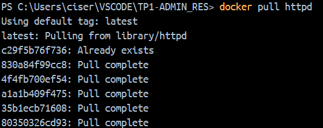

J'ai ensuite démarré un premier container sur le port 80 de ma machine avec: ```docker run --name=myapache -p80:80 httpd```

Puis un deuxième container sur le port 8080 de ma machine avec: ```docker run --name=myapache2 -p8080:80 httpd```

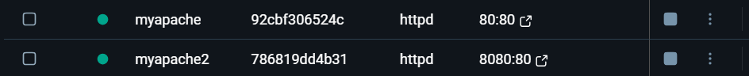

Pour renter dans  chaque container, j'ai utilisé la commande suivante: ```docker exec -it [nom du container] bash``` avec pour nom du container **"myapache"** et **"myapache2"**

Puis j'ai fait un ```apt update``` et ```apt install -y nano``` puis j'ai modifié le fichier html pour chaque comme suit:

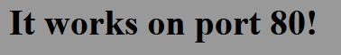


Dans un répertoire, j'ai créé un dossier avec un fichier **Dockerfile** à l'interieur contenant les commandes suivantes:

```
FROM httpd:latest
RUN apt update && apt install -y nano
COPY index.html /usr/local/apache2/htdocs
```

Puis j'ai construit l'image avec la commande suivante: ```docker build -t myhttpd .```

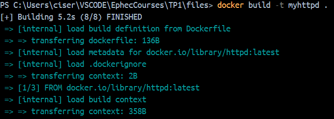

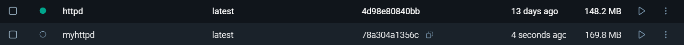

Pour terminer, j'ai créé un container à partir de cette image avec la commande suivante: ```docker run --name=myapache3 -p1411:80 myhttpd``` puis je l'ai lancé et j'ai observé qu'il est accessible en dehors de la machine.

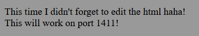

### 4.2. Lancer un résolveur Bind dans un container Docker

J'ai pull l'image Bind comme ceci:

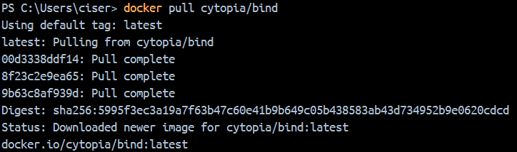

Puis j'ai créer un container à partir de cette image avec la commande suivante:

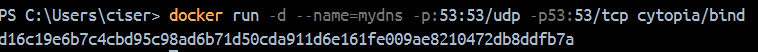

Une fois le container lancé, j'ai testé la commande ```nslookup 127.0.0.1 google.com``` qui n'a pas abouti.

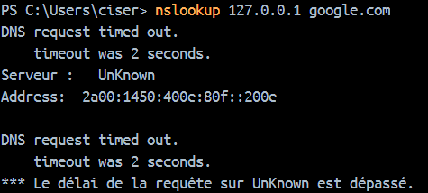

Et inversement, j'ai testé la commande ```nslookup google.com 127.0.0.1``` qui a abouti.

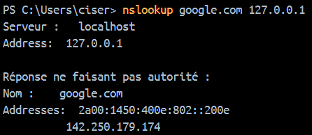

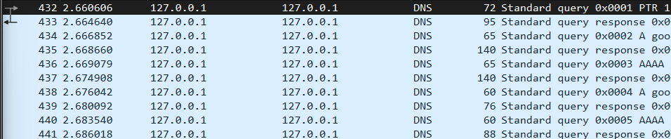

Puis je suis rentré dans le container afin de mofifier le fichier **/etc/bind/named.conf.options** comme suit:

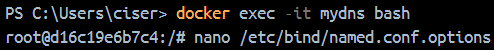

Afin de rajouter les lignes ci-dessous permettant le forwarding:

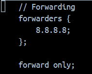

1. Quelle configuration avez-vous effectuée au niveau des ports ?

Pour la configuration des ports, j'ai lancé le container sur le port 53/tcp et 53/udp car le service DNS utilise le port 53 avec les protocoles TCP et UDP (voir photo ci-dessus).

2. Qu'avez-vous observé dans la trace Wireshark qui prouve que la configuration est correcte?  Illustrez avec un screenshot de la capture.


### 4.3. Container avec script Python

J'ai effectué une recherche pour le tag de python a installer, **python:3.12.9-alpine3.21**. J'ai ensuite constitué le Dockerfile des lignes suivantes:
    ```

    FROM python:3.12.9-alpine3.21

    COPY main.py /app/main.py

    WORKDIR /app

    CMD ["python", "main.py"]


J'ai créé l'image avec la commande suivante: ```docker build -t display-hour .``` et j'ai lancé le container avec la commande suivante: ```docker run --rm display-hour```

Comme il ne sert qu'à afficher l'heure, il n'est pas nécessaire de garder le container après son utilisation d'où le ```--rm```.

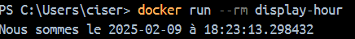
