# TP2 : Suite de la découverte de Docker

Nom de l'auteur :  Thomas CISERANE
Date de réalisation : 21/02/2025

## 1. Les volumes Docker

Documentez les commandes importantes de cette section.

```docker run  -p 80:80 --name web --mount type=bind,source="$(pwd)"/html,target=/usr/share/nginx/html/ custom-nginx``` : Crée un container web utilisant le port 80 et un volume de type bind, c'est-à-dire que le contenu du volume sera dans un dossier partagé entre le hote et le container.

```docker run  -p 80:80 --name web-volume --mount source=mon-volume,target=/usr/share/nginx/html/ custom-nginx``` : Crée un container web utilisant le port 80 et un volume de type volume, c'est-à-dire que le contenu du volume sera gérer par docker, non atteignable par l'hôte lui-même mais depuis un ou plusieurs containers.

Quelles sont les différences entre les deux types de volumes utilisés ici ?  Dans quel cas utiliser l'un plutôt que l'autre?

Le premier "Bind Mount" sert à lier un dossier partagé entre le hote et le container, tandis que le deuxieme "Volume" sert à lier des données gérées par docker dans un répertoire accesible depuis un ou plusieurs containers.

Bind Mount -> En développement, lorsque l’on veut modifier des fichiers sur l’hôte et voir les changements en temps réel dans le conteneur.

Volume -> En production, pour garantir une gestion sécurisée et fiable des données.

## 2. Les réseaux Docker

Documentez les commandes importantes de cette section.

2.1

2.2

docker network create my-net : Crée un nouveau réseau my-net.
docker network ls : Affiche la liste des réseaux.
docker network inspect my-net : Affiche les informations du réseau my-net.
docker network create --subnet=10.10.10.0/24 custom-network : Crée un nouveau réseau custom-network avec un sous-reseau de 10.10.10.0/24.

### 2.1. Réseau par défaut

1. Quelles sont les interfaces réseau et adresses IP de chaque container? Vous pouvez trouvez cette information soit depuis l'hôte avec un ```docker inspect```(cfr TP1), soit depuis le container lui-même.  Note dans ce dernier cas : Si la commande ```ip addr```n'est pas disponible, installez le package ```iproute2```.

Après l'exécution de la commande ```docker exec -it nom_du_container bash``` pour les containers respectifs, web-volume et web2-volume, puis la commande ```ip addr``` une fois dans le conatiner, on retrouve les informations suivantes:

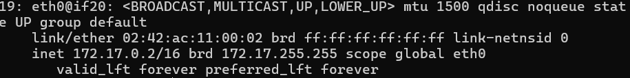

web-volume a pour addresse IP : 172.17.0.2/16

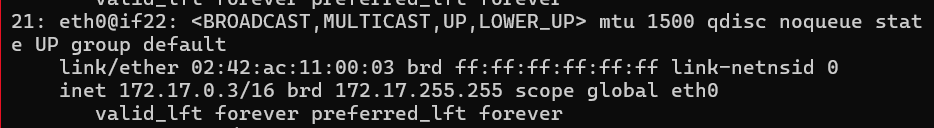

web2-volume a pour addresse IP : 172.17.0.3/16

Et ces deux containers ont pour gateway : 172.17.0.1/16

2. Les containers peuvent-ils se joindre via ```ping``` ?

Oui les containers peuvent se joindre via ping.

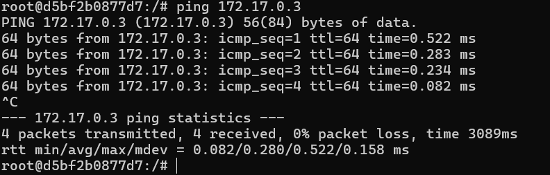

3. Les containers ont-ils accès à Internet ?

Oui les containers ont accès à internet.

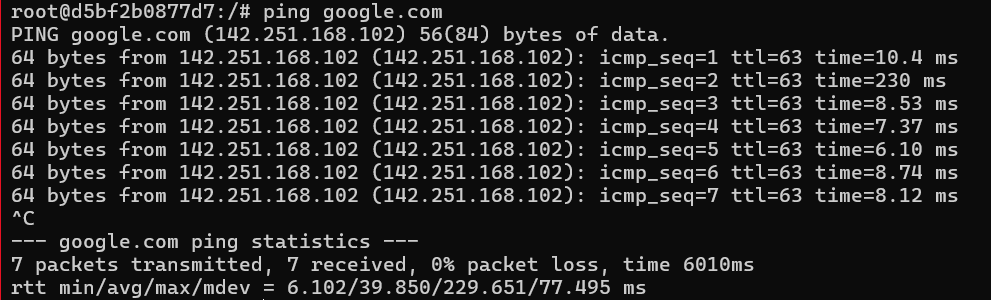

4. Est-ce une bonne idée d'utiliser ce réseau par défaut?  Quels en sont les avantages et les inconvénients ?

Il n'est pas conseillé d'utiliser le bridge par défaut car il permet de communiquer entre les containers, et cela peut poser des problèmes de sécurité.

Avantages:

* Permet au container de communiquer entre eux
* Permet au container d'accéder à Internet

Inconvénients:

* Moins de fonctionnalités qu'un réseau bridge personnalisé (pas de DNS par exemple)
* Une gestion moins efficace des conteneurs par rapport à la configuration des hôtes
* Moins sécurisé que les réseaux créés par l'utilisateur
* Permet d'attacher/détacher un container du réseau uniquement au démarrage

### 2.2. Réseaux définis par l'utilisateur

1. Le nouveau container ajouté sur le réseau ```my-net``` peut-il contacter les deux précédents (liés au réseau bridge par défaut)?  A-t-il accès à Internet?

Après un ```docker exec -it web-my-net bash``` puis ```ping 8.8.8.8```,  on voit que le container **web-my-net** a  accès à internet.

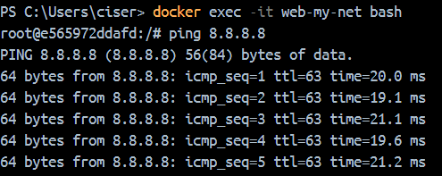

Après un ```ping 172.17.0.2``` (IP de web-volume2), on voit qu'il est impossible de ping le container **web-volume2** car ils sont sur des reseaux différents.

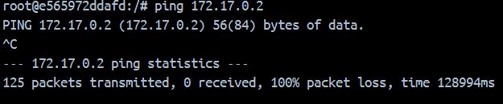

Après avoir créer un nouveau conatiner avec ```docker run -d --net my-net --name web-my-net2 custom-nginx``` puis un ```docker exec -it web-my-net2 bash```, j'ai ping le container **web-my-net** via son IP:

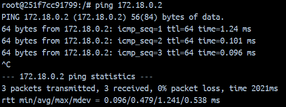

Puis via son nom:

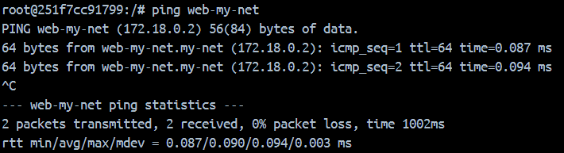

2. Quels sont les différences entre ce nouveau réseau et le bridge par défaut?  Quels en sont les avantages et inconvénients ?

3. Différences entre le réseau personnalisé (my-net) et le bridge par défaut

    1. Gestion du DNS

        my-net : Dispose d’un DNS intégré, permettant la communication entre conteneurs par leur nom.

        Bridge par défaut : Pas de résolution DNS automatique, les conteneurs doivent communiquer via leur adresse IP.
    2. Isolation des Conteneurs

        my-net : Les conteneurs connectés sont isolés du réseau par défaut et ne peuvent communiquer qu’avec ceux attachés au même réseau.

        Bridge par défaut : Tous les conteneurs y sont connectés par défaut, ce qui peut poser des problèmes de sécurité et de gestion.

    3. Personnalisation

        my-net : Permet de configurer des règles spécifiques (ex : sous-réseau, passerelle, sous-domaines).

        Bridge par défaut : Aucune personnalisation possible, il suit une configuration statique.

Avantages:

* Une gestion plus efficace des containers
* Permet d'attacher/détacher un container dynamiquement
* Plus sécurisé que le réseau bridge par défaut
* Optimisation des performances

Inconvénients:

* Nécessite une configuration manuelle
* Si mal géré, il peut poser des problèmes de connectivité et de sécurité
* Peut consommer plus de ressources avec le DNS

## 3. Docker-compose

1. Qu'avez-vous observé lors de cette première expérience avec Docker Compose ?  Faites un court bilan sur base de screenshots.

Pour commencer j'ai créé un fichier ```docker-compose.yaml``` avec les commandes fournies.

Ensuite j'ai exécuté la commande ```docker compose up``` et j'ai remarqué que tout ce qui était dans le fichier ```docker-compose.yaml``` s'est créé(caontainers, volume, réseau) et était préfixé de tp2.

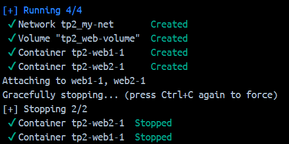

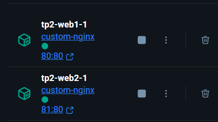

Après j'ai vérifé que les containers fonctionnaient en allant sur leur page web.


Puis est modifié le fichier ```index.html``` dans le volume ```tp2_web-volume``` et j'ai remarqué que la modification s'est appliquée.


Avec la commande ```docker inspect tp2_my-net``` j'ai remarqué que le container **tp2-web1-1** avait une adresse IP : 10.0.1.2/24 et le container **tp2-web2-1** avait une adresse IP : 10.0.1.3/24.

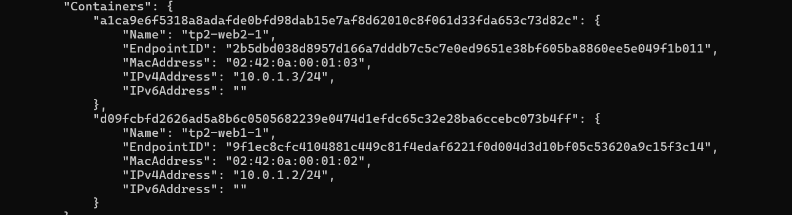

Pour faire un ping, avant tout je suis rentré dans le container **tp2-web1-1** avec ```docker exec -it tp2-web1-1 bash``` et j'ai fait un ping vers le container **tp2-web2-1**:

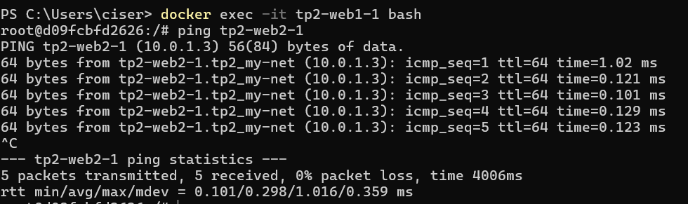

Puis j'ai fait un ```docker compose down``` et j'ai remarqué que tous les containers et le réseau sont supprimés.

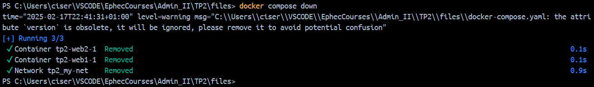

2. Documentez les commandes importantes.

```docker compose up``` 

```docker inspect [container | network]```

```ping [IP | name]```

```docker compose down```

## 4. Exercices récapitulatifs

### 4.1. Mise en application simple

 Votre infrastructure est-elle conforme à ce qui était attendu?  Comment avez-vous pu la valider?  Donnez les commandes utilisées et illustrez le résultat par des screenshots.

Pour ce faire j'ai d'abord créé un fichier ```docker-compose.yaml``` avec les commandes ci-dessous.

```
version: '3'
name : tp2
services:
  ContainerA:
    image: custom-nginx
    ports:
      - 80:80
    volumes:
    # Access volume1
      - volume1:/app
    # Access bind mount
      - ../../src:/src
    networks:
      - net1

  ContainerB:
    image: custom-nginx
    ports:
      - 81:80
    volumes:
    # Access volume1
      - volume1:/app1
    # Access volume2
      - volume2:/app2
    networks:
      - net1
      - net2

  ContainerC:
    image: custom-nginx
    ports:
      - 82:80
    volumes:
    # Access volume2
      - volume2:/app
    networks:
      - net2

volumes:
  volume1:
  volume2:

networks:
  net1:
    driver: bridge
    ipam:
      config:
      - subnet: 10.0.1.0/24

  net2:
    driver: bridge
    ipam:
      config:
      - subnet: 10.0.2.0/24
```

Puis j'ai exécuté la commande ```docker compose up```.

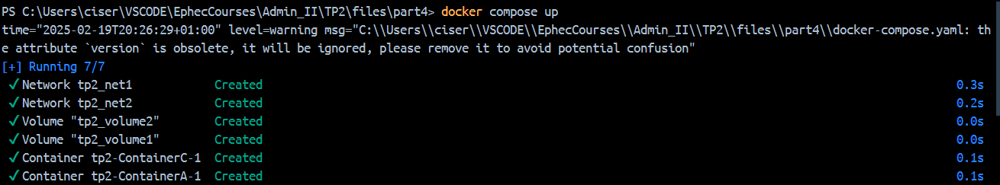

Une fois lancé, je suis rentré dans chaque container avce la commande ```docker exec -it [nom_du_container] bash``` pour les containers respectifs, puis j'ai utilisé la commande ```ip addr``` une fois dans le conatiner, on retrouve les informations suivantes:

**ContainerA**:

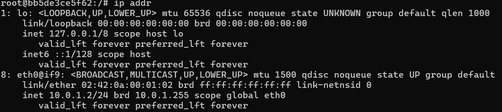

Il est bien dans le réseau 1 ```10.0.1.0/24```, et il a une addresse IP : 10.0.1.2/24

**ContainerB**:

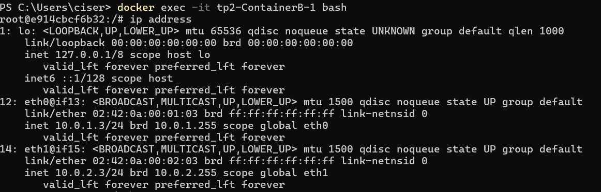

Il est bien dans le réseau 1 ```10.0.1.0/24```, et il a une addresse IP : ```10.0.1.3/24```
Mais également dans le réseau 2 ```10.0.2.0/24```, et il a une addresse IP : ```10.0.2.3/24```

**ContainerC**:

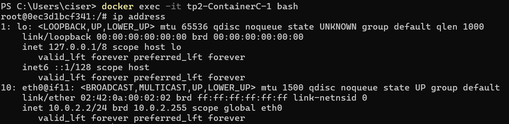

Il est bien dans le réseau 2 ```10.0.2.0/24```, et il a une addresse IP : ```10.0.2.2/24```

J'ai ensuite effectué un ping du container **ContainerA** vers le container **ContainerC**:

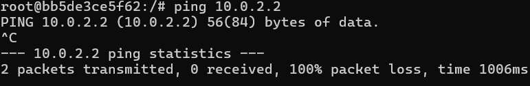

Comme attendu, le ping ne fonctionne pas car ils ne sont pas dans le même réseau.

Et j'ai effectuer un ping du container **ContainerA** vers le container **ContainerB**, qui est ici concluant:

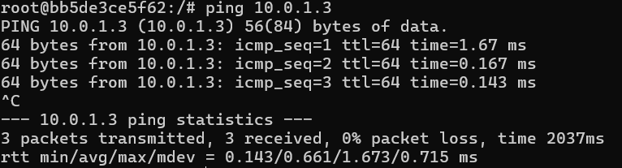

Nous avons vérifié les réseaux et les connectivités, maintenant passon au volumes et bind mounts.

Avec la commande ```docker inspect nom_du_container | grep -A 5 "Mounts"``` pour les containers **ContainerA**, et **ContainerC** et la commande ```docker inspect ContainerB | grep -A 10 "Mounts"``` pour le container **ContainerB**, j'ai remarqué que les volumes et bind mounts sont bien accessibles.

**ContainerA**:

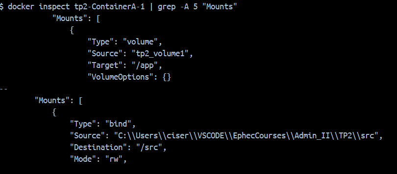

**ContainerB**:

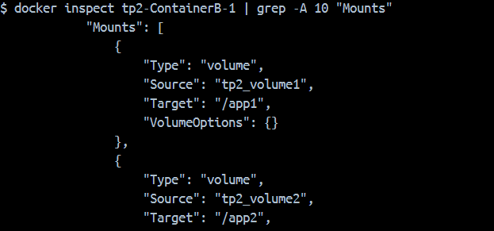

**ContainerC**:

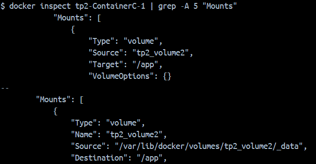

Les réseaux, bind mounts et volumes concordent avec ce que voulait la démarche.

Je conclus que l'infrastructure est conforme.

### 4.2. Exemple du cours théorique

1. Dans cette infrastructure, comment les données sont-elles partagées?  Via des Bind Mounts ou des Volumes?  Pourquoi ?

Dans cette infrastructre, le container **WEB** a un dossier partagé "/app" avec l'hôte sur son dossier "/src", et le container **DB** utilise un volume pour la base de données reliée à son directory "/mysql".

L'usage des 2 types de volumes sont utilisés ici afin de garantir à un niveau de sécurité plus accru évitant à l'hôte d'avoir accès à la base de données.

Les deux containers peuvent communiquer car ils sont sur le même réseau qui est ```net```.

2. Quels sont les spécificités de chaque container?

Le container **WEB** a pour rôle d'hébergé une application web, et le container **DB** a pour rôle de gérer la base de données MySQL.

3. Une fois démarrée, l'infrastructure est-elle conforme à ce qui était attendu?  Comment avez-vous pu la valider?  Donnez les commandes utilisées et illustrez le résultat par des screenshots.

Une fois démarrée, j'ai commence par vérifié le fonctionnement de container **WEB**. Ça page internet qui s'affiche:


Puis j'ai manuellement ajouté un fichier ```test.txt``` dans le dossier ```/src``` de l'hôte et vérifier le bind mount fait sur le dossier ```/app``` du container **WEB**. Avec la commande ```docker exec -it app-web-exemple-web-1 bash``` je suis rentré dans le container **WEB**:

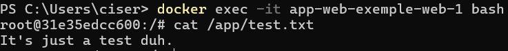

Puis pour chaque contaier j'ai rentré ```docker inspect [container] | grep "IP"``` et ils sont bien sur le même réseau.

IP du container **WEB**: 172.19.0.3/16

IP du container **DB**: 172.19.0.2/16

Pour montrer la connectivité et  et simuler une requête possible du container **WEB** vers le container **DB**, j'ai effectuer un ping:

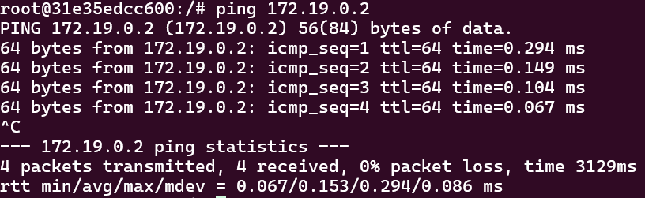

### 4.3. Exemple du tutoriel Docker

1. Quelles sont vos observations suite à la réalisation de ce tutoriel ?

À la suite de ce tutoriel, j'ai remarqué que les containers sont utilisés pour lancer tous types d'applications.

2. Sur quelle base les containers sont-ils lancés ?

Les containers sont lancés sur une base Python. et Redis.

3. Qu'avez-vous appris de nouveau ?

Que l'on peut découper la logique du infrastructure en plusieurs fichier .yaml et lors de la création du ```compose.yaml```, on peut les inclures avec ```include```.

Aussi la fonction ```develop watch``` permet de faire des modifications sans avoir besoin de relancer le container.
